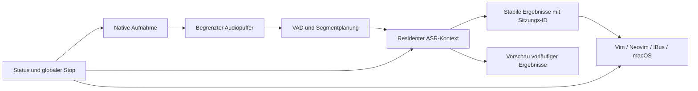

# SOTA-Analyse für die Produktfreigabe

Stand und Recherche: 6. September 2026. Eigene Evidenz: [Implementierungsbericht](IMPLEMENTATION-2026-09-06.md). Verbindlicher Arbeitsstand mit erledigten Aufgaben und Abnahmetoren: [Produktplan](PRODUCT-PLAN.md). Die folgenden Architektur- und Modellauswahlen sind Empfehlungen bzw. zu messende Hypothesen; in diesem Dokument wurde kein neuer ASR-Benchmark durchgeführt.

## Entscheidung

Geist-Diktat sollte eine lokale Diktatlösung mit austauschbarer Erkennungsengine und geprüften Plattformprofilen werden. Die eigene Stärke liegt in Aufnahme, zuverlässiger Sitzungssteuerung und Einbettung in Anwendungen. Das ASR-Modell wird anhand deutscher Qualität, Einfügelatenz, Speicherbedarf und Betriebsstabilität ausgewählt. Ein einzelner Leaderboard-Platz beantwortet diese Produktfrage nicht.

**Erster konkreter Versuch: residenter whisper.cpp-Adapter, auf dem Pi5 zunächst small Q5_1 / Beam 1.** Der eigene Vergleich belegt bereits erheblich weniger RAM und weniger Wortfehler als Geist/Gemma. Er belegt noch keine kontinuierliche Nutzbarkeit: Beide bisher geprüften Adapter überlasten bei zeitgetreuer Gesprächszufuhr. Daher wird der Standardbackend noch nicht allein aufgrund der zwölf Pilotaufnahmen umgestellt.

## Was die bisherige Architektur begrenzt

Der Core sammelt derzeit VAD-Äußerungen bis maximal 28 Sekunden und transkribiert synchron. Der Whisper-Vergleich startet sogar für jedes Segment einen neuen CLI-Prozess samt Modellladen. Der Supervisor nimmt zwar separat auf, seine sechs Sekunden Queue können einen langen Decode-Stillstand aber nur kurz überbrücken. Die Überlast nach etwa 32–34 Sekunden ist ein nachgewiesenes Problem dieser Kombination.

Bei Geist ist das Modell bereits innerhalb einer Sitzung geladen. „Resident machen“ darf dort nicht als bereits bewiesene Beschleunigung verkauft werden. Zuerst müssen Modellinitialisierung, Audioübernahme, Encoder, Decoder und Ausgabe instrumentiert werden. Auch Pipes und Recorderpuffer gehören zur Betrachtung. Ein mittlerer RTF von 0,95 sagt nichts darüber aus, ob der Decoder zwischenzeitlich länger blockiert als die Queue überbrücken kann.

Empfohlener Datenfluss:

Das Diagramm beschreibt den Zielzustand, nicht die vollständige aktuelle Implementierung. Ein Hintergrundprozess darf warm bleiben, ohne weiterhin das Mikrofon zu öffnen. Aufnahme und automatische Einfügung haben eigene explizite Zustände. V1 bleibt PCM-Eingabe und finale UTF-8-Zeilen; ein zusätzlicher Ereignismodus transportiert Zeitstempel, Sitzung, vorläufige/finale Ergebnisse und Fehler. Nur endgültiger Text wird automatisch eingefügt; vorläufiger Text bleibt Vorschau oder IME-Preedit. Fokuswechsel verwirft keine Ergebnisse still, erlaubt aber auch keine Einfügung in ein neues unbekanntes Ziel.

## Modell- und Runtime-Auswahl

| Kandidat | Verifizierte technische Grundlage | Rolle im Vergleich / Grenze |
|---|---|---|
| whisper.cpp small Q5_1 | C-API, ARM/x86, Quantisierung, Metal und Core-ML-Encoder sind dokumentiert | Höchste Priorität wegen eigener Pi-WER-/RAM-Evidenz; residenten Kontext und Segmentierung erst entwickeln |
| whisper.cpp mehrsprachiges base; auf Mac auch large-v3-turbo | Beide Modellfamilien werden vom Projekt unterstützt | Kleiner Pi-Kandidat bzw. stärkeres Desktop-Qualitätsprofil; Deutsch und Rauschen neu messen |
| faster-whisper / CTranslate2 INT8 | CPU-INT8 ist im offiziellen Projekt dokumentiert | Kontrollvergleich auf Ubuntu x64 mit gleicher Threadzahl, Modellgröße und Suchstrategie; kein aus Batchmessungen abgeleiteter Live-Nachweis |
| Parakeet-TDT-0.6B-v3 | NVIDIA nennt Deutsch unter 25 Sprachen; 600-Millionen-Parameter-Modell, CC BY 4.0 | Moderner mehrsprachiger Herausforderer; CPU/ARM-Export, RAM, lange Sprache und Lizenzhinweise am konkreten Artefakt prüfen |
| Qwen3-ASR 0.6B / 1.7B | Offizielle Sprachliste enthält Deutsch; Streaming im dokumentierten Paket derzeit über vLLM | Zunächst Desktop-/geeigneten GPU-Referenzpfad prüfen. Kein belegter, einfach installierbarer Pi5-Streamingpfad |
| Apple SpeechAnalyzer / SpeechTranscriber | Apple beschreibt lokale Transkription; Geräte-/Sprachverfügbarkeit ist über API prüfbar | Optionaler nativer Mac-Vergleich, falls Ziel-OS, Gerät und deutsche Locale unterstützt sind; keine plattformübergreifende Engine |

Primärquellen zu den Kandidaten: [whisper.cpp](https://github.com/ggml-org/whisper.cpp), [faster-whisper](https://github.com/SYSTRAN/faster-whisper), [NVIDIA-Modellkarte](https://huggingface.co/nvidia/parakeet-tdt-0.6b-v3), [Qwen3-ASR](https://github.com/QwenLM/Qwen3-ASR), [Apple SpeechAnalyzer](https://developer.apple.com/videos/play/wwdc2025/277/) und [SpeechTranscriber-Verfügbarkeit](https://developer.apple.com/documentation/speech/speechtranscriber).

Die Sprachlisten sind keine Nachweise für österreichische oder Schweizer Dialektqualität. Insbesondere betreffen die bei Qwen beworbenen Dialekte nicht automatisch DACH. Parakeets lange Audiofenster sind ebenfalls kein Beleg für begrenzte Online-Latenz. Modellgröße allein sagt wenig über CPU-Laufzeit oder vollständigen Prozessspeicher aus. Neue Kandidaten werden erst nach erfolgreichem Build, Lizenz-/Artefaktprüfung und kurzen deutschen Smoke-Tests in den vollständigen Vergleich aufgenommen.

Für Streaming müssen wir außerdem die Ausgabepolitik wählen: WhisperStreaming untersucht wiederholt übereinstimmende Präfixe, während dessen Autoren inzwischen SimulStreaming als Nachfolger empfehlen. SimulStreaming ist eine nützliche Forschungsreferenz für die Entscheidung, wann Text endgültig ausgegeben wird; die dokumentierte leistungsstarke Konfiguration setzt GPU-Ressourcen voraus. Ein Übertragen auf den Pi5 ist eigene Entwicklungsarbeit mit offener Laufzeit. [WhisperStreaming](https://github.com/ufal/whisper_streaming), [SimulStreaming](https://github.com/ufal/SimulStreaming).

Die erste Umsetzung sollte deshalb keinen umfassenden Framework-Wechsel erzwingen: den vorhandenen Prozessvertrag beibehalten, im eigenen Adapter einen langlebigen Kontext nutzen und Fenster/Endpunkte kontrolliert variieren. Wenn das die Pi-Ziele verfehlt, braucht es ein kleineres oder nachweislich deutschfähiges natives Streamingmodell. Kein ungeprüftes englisches Streamingmodell erfüllt den deutschen Produktauftrag.

## Optimierungen für Pi5 nach erwartetem Nutzen

1. **Lade- und Segmentkosten trennen.** Whisper-Kontext wiederverwenden, Audio kontinuierlich lesen, Decode-Phasen instrumentieren. Vorteilshöhe noch offen; resident allein genügt nicht.
2. **Weniger Sucharbeit.** Beam 1 ist bereits gemessen: 13,7 % weniger Gesamtzeit und 24,8 % weniger Spitzen-RSS als Beam 5, bei zwei zusätzlichen Wortfehlern im Pilot. Qualität auf unabhängigen Daten absichern.
3. **Kleinere Rechenaufgabe.** Mehrsprachiges base, Quantisierungsvarianten und kürzere Eingabefenster prüfen. Überlappung und häufige Teildecodes erhöhen die Rechenlast; Wortgrenzen und Kontextverluste mitmessen.
4. **Threads und Kernel passend wählen.** 1/2/3/4 Threads, native ARM-Kernel und BLAS einzeln vergleichen. Verschachtelte Threadpools begrenzen; ein freier Kern kann Capture/GUI helfen, ist aber kein garantierter Gewinn.
5. **Thermisch reproduzierbar testen.** Netzteil, Kühlung, CPU-Frequenz und Drosselung dokumentieren. Raspberry Pi empfiehlt aktive Kühlung für beste Leistung; daraus folgt kein bereits gemessener Gewinn auf unserem Gerät. [Raspberry-Pi-Hardwaredokumentation](https://www.raspberrypi.com/documentation/computers/raspberry-pi.html).
6. **Zusatzhardware nachrangig.** GPU/NPU/HAT nur bei unterstütztem Modell, Operatoren, Treibern und messbarer Gesamtverbesserung. Mehr RAM oder schnellerer Datenträger kann Laden/Swap helfen, behebt aber nicht automatisch laufende Decoderkosten.

Jede Änderung einzeln auf denselben Entwicklungsclips vergleichen; danach den vollständigen Live-Test wiederholen. Freigabe verlangt Qualität **und** Latenz/RAM/Temperatur, nicht einen isolierten schnellen Lauf. Die bisherigen CPU-Piloten bleiben Referenz; ein möglicher GPU-Pfad bekommt eine eigene Ergebnisreihe.

## Rauschen, Dialekte und Fehlereindämmung

Ein fester RMS-Schwellwert ist durch einen lernbasierten VAD-Kandidaten zu ergänzen. Silero stellt ONNX-Modelle bereit und unterstützt 16-kHz-Audio. RNNoise ist ein separater Kandidat zur Rauschminderung; dessen Beispielpfad arbeitet mit 48 kHz, sodass Resampling und zusätzliche Kosten zu berücksichtigen sind. Beide Bausteine benötigen eine A/B-Abnahme mit sauberer und gestörter Sprache: Sie sind keine Garantie besserer WER. [Silero-VAD](https://github.com/snakers4/silero-vad), [RNNoise](https://github.com/xiph/rnnoise).

Ein VAD löst weder Dialektorthographie noch Halluzinationen während echter Sprache. Das Produkt braucht getrennte Aufgaben „Dialekt wörtlich transkribieren“ und „ins Hochdeutsche übertragen“, konsistente Referenzen und regionale Beurteilung. Für DACH werden deshalb zusätzliche eigene/rechtegeklärte Aufnahmen eingeplant. SwissDial- und Gesprächspilot bleiben Forschungsevidenz; eingeschränkte Audios und vollständige Referenzen werden nicht ungeprüft in öffentliche CI-Artefakte übernommen.

Namen, Zahlen, Negationen und Selbstkorrekturen separat auswerten. Automatische LLM-Umschreibung würde neue Bedeutungsfehler einführen und gehört nicht ungeprüft in den standardmäßigen Einfügepfad. Ein späteres Fachvokabular oder Fine-Tuning wird anhand wiederkehrender Fehler begründet, mit zulässigen Trainingsdaten umgesetzt und auf ungesehenen Sprechern geprüft. Konfidenzwerte dürfen erst nach Kalibrierung als verlässliche Nutzerhinweise gelten.

## Einbettung und One-Click

**Linux:** IBus-Text-Commit ist der erste systemweite Pfad; Vim/Neovim behalten ihre direkten Adapter. Für globale Hotkeys stellt XDG Desktop Portal eine eigene Schnittstelle bereit, deren tatsächliche Verfügbarkeit pro Desktop geprüft werden muss. Ein Portal beseitigt keine App-/IME-Kompatibilitätsprüfung. [GlobalShortcuts-Spezifikation](https://flatpak.github.io/xdg-desktop-portal/docs/doc-org.freedesktop.portal.GlobalShortcuts.html).

`wtype` verwendet virtuelle Tastatureingabe und bleibt eine bedingte Ausgabesenke. Als gesonderter optionaler Pfad wäre RemoteDesktop mit EIS/libei zu evaluieren: Die offizielle Schnittstelle verlangt eine vom Nutzer genehmigte Sitzung und kontrolliert Eingabegeräte. Das liefert keine automatische Erkennung geschützter Textfelder und sollte deshalb nicht unbemerkt den IBus-Pfad ersetzen. [wtype](https://github.com/atx/wtype), [RemoteDesktop-Portal](https://flatpak.github.io/xdg-desktop-portal/docs/doc-org.freedesktop.portal.RemoteDesktop.html).

**macOS:** Der vorhandene Swift-Prototyp wird zu einer selbstständig lauffähigen App ausgebaut: native Aufnahme, Gerätewahl, wirklicher Hörstatus, geführte Mikrofon-/Bedienungshilfenrechte, feste Einfügeziele, gebündelte Abhängigkeiten. Signierung/Notarisierung und Prüfung auf einem frischen Mac sind eigene Release-Arbeiten; ad-hoc-Signierung erfüllt diesen Auslieferungspfad nicht. [Apple: Notarizing macOS software](https://developer.apple.com/documentation/security/notarizing-macos-software-before-distribution).

**Bedienversprechen:** Nach Einrichtung ein Shortcut zum Diktieren. Erstinstallation umfasst Download und notwendige OS-Dialoge. Gemessen werden Zeit bis zum ersten korrekt eingefügten Satz, Hilfebedarf, Klicks und Recovery-Erfolg. Die vorhandene CLI-Diagnose und gebaute App allein belegen noch keinen einfachen Erststart. Entwicklerdetails wie Backend-Flags gehören in erweiterte Einstellungen; der normale Ablauf zeigt Mikrofon, Betriebszustand und verständliche Fehlerhilfe.

## Was gegenüber etablierten Lösungen gewinnen kann

| Dimension | Bereits belegt | Noch nachzuweisen |
|---|---|---|
| Lokale Verarbeitung | Lokaler Prozesspfad und Audiopuffer im Speicher | Vollständiges Paketverhalten in frischer Offline-Installation |
| Editor-/Linux-Einbettung | Eigene asynchrone Vim-/Neovim-Adapter, IBus und Prozessvertrag | Vollständige Desktop-/App-Matrix, zuverlässige tägliche Bedienung |
| Ressourceneinsatz | Austauschbarer Whisper-Vergleich spart auf Pi5 viel RAM | Ausgewähltes Produktprofil mit Dauerlastreserve |
| Erkennungsqualität | Reproduzierbarer deutscher Vergleich vorhanden | Aktueller Geist-Standard gewinnt den Pilot nicht; DACH/Rauschen offen |
| Installation und Betrieb | Pakete, Setup/Doctor und Mac-Prototyp | Ohne Entwicklerwerkzeuge, Update/Recovery, Nutzertest bestanden |

Offline-ASR und native Aufnahme sind auch in den oben verlinkten etablierten Bausteinen vorhanden. Der differenzierende Produktwert muss daher aus dem gesamten Arbeitsablauf entstehen: verlässliche Einfügung, nachvollziehbarer Stop, sichere Fokuswechsel, gute Editorintegration und geringer Korrekturaufwand. Das lässt sich messen, ohne ein eigenes Grundmodell als zwingende Voraussetzung zu behandeln.

Für einen Produktvergleich dieselben Nutzer dieselben Diktataufgaben in wechselnder Reihenfolge erledigen lassen: Zielsystem versus etablierter lokaler Referenzclient bzw. Betriebssystem-Diktat, sofern auf der Plattform verfügbar. Erfassen: erfolgreiche Einfügung, Korrekturzeit pro 100 Wörter, Fehlaktivierungen, Startzeit, Einfügelatenz und Einrichtungsaufwand. Reine WER und reine Code-Coverage reichen dafür nicht. Ein SOTA-Anspruch bleibt solange eine Entwicklungsrichtung, bis auf diesen Zielaufgaben ein belastbarer Vorteil belegt ist.
