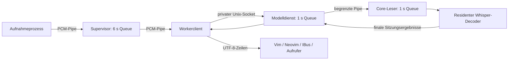

# Supervisor und Modellhaltung auf dem Pi5

Implementierung zu #36/#37, September 2026. Der Pi5 bleibt ein experimentelles
Profil. Der lokale Worker ergänzt den bisherigen begrenzten Supervisor und den
residenten Whisper-Decoder; er ist kein Netzwerkdienst und kein öffentlich
zugesagtes Ereignisprotokoll.

## Verhalten beim Diktieren

Das installierte `whisper-small`-Profil verwendet standardmäßig den Modellworker
mit vier Threads und `OMP_WAIT_POLICY=PASSIVE`. Eine ausdrückliche Thread-/Wait-
Konfiguration bleibt möglich. Capture startet erst, wenn der Worker ein geladenes
Modell und eine zugeordnete Sitzung bestätigt. Kaltes Laden verbraucht somit nicht
den sechsekündigen Aufnahme-Puffer.

```sh
geist-diktat worker start   # optional vorladen, ohne Mikrofonaufnahme
geist-diktat worker status  # Modell/PID, belegt/frei, Leerlaufgrenze
geist-diktat run            # Aufnahme und normale UTF-8-Textzeilen
geist-diktat worker stop    # Modell und gegebenenfalls Sitzung beenden
```

Ein reguläres Audioende finalisiert den letzten Abschnitt und erhält das Modell.
Die finale Textausgabe ist ausdrücklich als UTF-8 codiert, auch bei einer ASCII-Prozesslocale. Stop während des Wartens auf neue Sprache verwirft die unvollständige Sitzung;
VAD, Audio und Ausgaben werden für die nächste Sitzung zurückgesetzt. Jede Sitzung
hat eine neue Kennung. Stop während Decode verwirft den Modellprozess, weil die
Engine einen Abbruch nicht in jeder Rechenphase zeitnah quittiert. Der nächste
Start lädt dann neu. Ein außerhalb des Decodes angeforderter Sitzungsabbruch
bekommt höchstens 350 ms zur Quittierung, danach wird ebenfalls neu geladen.

Nach standardmäßig **60 Sekunden ohne aktive Sitzung** endet der Dienst und gibt
Modell sowie Speicher frei. `GEIST_DIKTAT_IDLE_SECONDS` erlaubt 1–3600 Sekunden.
`GEIST_DIKTAT_REUSE_MODEL=0` wählt ausdrücklich den bisherigen Prozess je Diktat.
Änderungen an der Leerlaufgrenze gelten für den nächsten Dienststart; einen bestehenden Dienst vorher mit `worker stop` beenden. Doctor berichtet die konfigurierte Workerpolitik. Status und Stop funktionieren
auch bei beschädigter Profilkonfiguration. Bei geändertem Modell/Binary oder
anderen Decoderparametern den bestehenden Worker mit `worker stop` beenden;
ein abweichender Client erhält einen Fehler statt eine falsche Konfiguration.

## Grenzen und Schutz gegen Rückstand

- Aufnahmequeue: weiterhin sechs Sekunden standardmäßig, sichtbarer Überlauf
  mit Exit 75. Capture und Decoderclient gehören der aufrufenden Sitzung.
- Transport zum Modell: höchstens eine Sekunde gepufferte PCM-Pakete plus eine
  Sekunde Lookahead im C++-Leser. Linux-Pipes werden vor Kindprozessstart auf
  8 KiB angefordert (auf diesem Pi wegen 16-KiB-Seiten effektiv 16 KiB).
  Zuvor waren es 256 KiB bzw. 8,192 s Audio je Pipe. Die Socketpuffer
  werden auf 4 KiB angefordert; Linux kann den Wert intern verdoppeln.
  Python-I/O-Puffer kommen hinzu; sechs Sekunden sind die Supervisor-Queue,
  keine Behauptung einer sechsekündigen Gesamtpipeline.
- Ausgabe: begrenzte Ereignis-/Textpuffer; keine unbegrenzte Sitzungsliste.
  Ein weiterer aktiver Start erhält Busy (Exit 73). Ein unabhängiger HUP-Poll
  erkennt den geschlossenen aktiven Client auch dann, wenn wegen voller Queue
  keine normalen Audio-Leseereignisse mehr abonniert sind.
- Der private Unix-Socket liegt unter `$XDG_RUNTIME_DIR/geist-diktat`, ersatzweise
  `$XDG_CACHE_HOME/geist-diktat` bzw. `~/.cache/geist-diktat`. Das Verzeichnis muss
  dem Benutzer gehören, Modus 0700 haben und darf kein Symlink sein. Der Socket
  hat Modus 0600; ein Betriebssystem-Lock verhindert doppelte Dienste.
- Modellpfad, Dateistand, Decoder, RMS und wirksame Parameter müssen zum laufenden
  Dienst passen. Alte Sitzungen liefern keinen Text in die neue Sitzung.
- Keine Speicherung von aufgenommenem PCM oder Transkript durch den Worker.
  Optionaler Trace enthält numerische Zustands-/Audiozähler. Die neuen
  `buffer_state`-Proben dokumentieren den Rückstand alle fünf Sekunden.

Der Worker beschleunigt eine laufende Inferenz nicht beliebig. Ein ausreichend
schneller Decoder, geprüfte Sprachqualität und brauchbare Endlatenz bleiben nötig.
Insbesondere ist ein RTF unter 1 noch kein Nachweis von höchstens drei Sekunden
bis zur Einfügung.

## Datenpfad



Die Aufnahme startet nach der Bereitschaftsbestätigung. Bei Überlast stoppt
der Supervisor seine eigenen Prozesse mit einem sichtbaren Fehler. Bei Cancel
schließt der Client; der Dienst verwirft die Sitzung und unterbindet ihre
weiteren Ausgaben. Die unabhängigen internen Sitzungskennungen ersetzen noch
nicht den geplanten öffentlichen Zustands-/Ereignisvertrag aus #34/#35.

## Reproduzierbare Messungen

`benchmarks/worker_bench.py` prüft identische menschliche deutsche Aufnahmen mit
frei gewählter Thread-/Beam-/Wait-Matrix. Modellladen wird separat gemessen; die
folgenden Aufrufe nutzen denselben Modellprozess. WER, Bytevollständigkeit,
Laufzeit, PID, Prozessbaum-RSS/-Swap, systemweiter Swap, Temperatur und
`get_throttled` werden getrennt erfasst. Vorhandene historische Drosselungsbits
sind keine während dieses Laufs beobachtete Drosselung.

```sh
python3 benchmarks/worker_bench.py --binary build/whisper-resident/diktat-whisper \
  --model build/ggml-small-q5_1.bin --manifest build/speech-corpus/manifest.json \
  --threads 1,2,4 --beams 5 --waits PASSIVE,ACTIVE --per-group 1 \
  --output build/pi-worker-screening.json
# Vollständiger Entwicklungs-Pilot statt Vorauswahl:
python3 benchmarks/worker_bench.py --binary build/whisper-resident/diktat-whisper \
  --model build/ggml-small-q5_1.bin --manifest build/speech-corpus/manifest.json \
  --threads 4 --beams 5 --per-group 0 --output build/pi-worker-quality.json
```

`--paced` prüft zeitgetreue Zuführung. Die dabei ausgewiesene Latenz bezieht sich
auf das Dateiende, nicht auf menschlich annotierte Sprachendpunkte oder eine
Zielfeldänderung. Sehr kleine Stichproben tragen ihren Umfang bei p50/p95 mit.

`benchmarks/worker_soak.py` führt den tatsächlichen Supervisor mit Workerclient
und einer zeitgetreuen Dateiquelle aus. Für einen Stundenlauf wird vorhandene
Gesprächssprache wiederholt. Referenzen und Audio bleiben lokal; nur numerische
Metriken und Hashes werden archiviert. Ein 60-Minuten-Lauf enthält einen
30-Minuten-Zwischenstand und ist kein zusätzlich separat abgeschlossener
30-Minuten-Lauf.

```sh
python3 benchmarks/worker_soak.py --binary build/whisper-resident/diktat-whisper \
  --model build/ggml-small-q5_1.bin --manifest build/speech-corpus/manifest.json \
  --group de-conversation-long --minutes 60 --threads 4 --beam 5 \
  --output build/pi-worker-soak.json
```

Nur vollständige Läufe bekommen eine WER. Für lange Läufe müssen Byte-/Sample-
Bilanz, ein Modellladen, Speichergrenze (1,5 GiB Prozessbaum), höchstens 64 MiB
Anstieg der RSS-Mediane nach Aufwärmen, kein Prozess-Swap und keine beobachteten
aktiven Drosselungsbits bestehen. Hardwaremodell, Betriebssystem und tatsächlich
vorhandene Konkurrenzlast gehören zur Auswertung. Diese Tests ersetzen weder
physische Mikrofon-/Treiberabnahme noch das Einfügen in reale Anwendungen.

## Pi-Messreihe: Implementierung und Qualitätsentscheidung

Getestet auf Raspberry Pi 5 Model B Rev 1.1, 4 GiB, Debian/Raspberry Pi OS
arm64, Kernel 6.18.33, 16-KiB-Seiten und Governor `ondemand`. Das ist kein
Ubuntu-GNOME-Hardwaretest. OpenBLAS 0.3.29 war bereits installiert. Die Builds
nutzen die gepinnte whisper.cpp-Revision und dasselbe small-Q5_1-Modell;
`GGML_NATIVE=ON` bleibt ein Build für dieses Gerät, keine portable Distribution.

Alle folgenden vollständigen Piloten enthalten zwölf saubere Aufnahmen
(294 Wörter, 181,56 s) und sechs 10-dB-Aufnahmen (130 Wörter, 70,5 s), mit
vier Threads/PASSIVE. RTF misst Dateidurchsatz nach getrenntem Modellstart,
nicht die Latenz einer Mikrofonaufnahme oder Texteingabe.

| Variante | Saubere WER | 10-dB-WER | Saubere RTF | Einordnung |
|---|---:|---:|---:|---|
| Native, voller Kontext, Beam 5 | 8,84 % (26/294) | 28,46 % (37/130) | 1,082 | Zu langsam; Rauschziel verfehlt |
| OpenBLAS, adaptiver Kontext, Beam 5, 28 s | 6,80 % (20/294) | 21,54 % (28/130) | 0,433 | Beste Pilotqualität; Gesprächspfad überlastet |
| Gleich, maximal 12 s | 7,48 % (22/294) | 27,69 % (36/130) | 0,435 | Rauschziel verfehlt; separater Stabilitätsversuch |
| Gleich, maximal 8 s | 11,22 % (33/294) | 37,69 % (49/130) | 0,437 | Beide Qualitätsziele verfehlt |
| 28 s, ohne Temperatur-Wiederholungen, Beam 5 | 6,80 % (20/294) | 21,54 % (28/130) | 0,431 | Keine relevante Verbesserung; ebenfalls Überlast |
| 28 s, ohne Temperatur-Wiederholungen, Beam 3 | 8,50 % (25/294) | 25,38 % (33/130) | 0,374 | Schneller, Rauschziel knapp verfehlt |

Die Thread-/Wait-Vorauswahl nutzte jeweils nur einen sauberen und einen
verrauschten Clip. Mit Beam 5 ergaben 1/2/4 Threads ungefähr RTF 2,16/1,11/0,59
auf dem sauberen Clip. ACTIVE und PASSIVE unterschieden sich dort praktisch
nicht. Diese kleine Vorauswahl wird nicht als vollständiger Sprachvergleich
oder statistischer Performance-Nachweis ausgegeben. Der vollständige native
Pilot zeigte anschließend den deutlich schlechteren Wert 1,082.

Alle vollständigen Worker-Piloten bestätigten die Samplebilanz und denselben
Modellprozess über 18 Sitzungen. Der adaptive Beam-5-Pilot erreichte etwa
482 MiB gesampeltes Service-/Modell-RSS und null Prozess-Swap. Der neue
Modellprozess war bei warmem Betriebssystem-Dateicache nach etwa 0,18 s bereit;
die reine interne Sitzungszuteilung blieb unter 1 ms. Das ist weder Kaltbootzeit
noch die gesamte Shortcut-Latenz. Historische Drosselungsbits `0xe0000` und
systemweiter Swap waren schon vor den Versuchen vorhanden; sie werden nicht
als neu verursachte Drosselung oder Modell-Swap interpretiert.

Die Tests sind Entwicklungsdaten. Die Auswahl anhand dieses kleinen Korpus
ersetzt kein unabhängiges DACH-/Alltags-/Technik-Testset. Insbesondere wird die
Qualitätsgrenze von 25 % bei 10 dB nicht zugunsten von Beam 3 oder kurzen
Fenstern angehoben.

## Abgeschlossene Dauerläufe

| Umgebung / Konfiguration | Audio / Gesamtzeit | Vollständige Audio-/Samplebilanz | WER | Speicher |
|---|---|---|---|---|
| Ubuntu, Standardprofil full/28 s/Beam 5 | 1809,14 / 1809,80 s | 57.892.480 Byte, ein Modellladen; Gesamttor bestanden | 245/2760 = 8,88 % | 538,39 MiB gesampeltes Spitzen-RSS; Mediananstieg 0,18 MiB; Prozess-Swap 0 |
| Mac M1 Max, full/28 s/Beam 5 | 1853,44 / 1857,20 s | 59.310.228 Byte, ein Modellladen; Transport bestanden | 1014/4425 = 22,92 % | Gesonderte Teilzeit-RSS-Probe: 606,03 MiB Spitze, Mediananstieg 0,89 MiB |
| Pi5, OpenBLAS/adaptive/12 s/Beam 5 | 3706,89 / 3713,55 s | 118.620.456 Byte, ein Modellladen; Transport-/Speichertor bestanden | 2240/8850 = 25,31 % | 516,19 MiB Spitze; Mediananstieg 0,16 MiB; Prozess-Swap 0 |

Auf dem Pi blieb kein unbestätigtes Byte übrig. Die Queue erreichte beobachtete
141.440 Byte, der maximale Schreibblock 4,43 s. Maximal wurden 71,6 °C und keine
aktiven Drosselungsbits beobachtet. Die Stundenstabilität besteht damit im
definierten Dateitest; die Einfügelatenz bis 3 s ist dadurch nicht abgenommen.
Der qualitätsbeste 28-s-Pfad besteht diesen Gesprächslauf nicht. Der stabile
12-s-Pfad verfehlt seinerseits mit 27,69 % 10-dB-WER das Rauschziel. Es gibt
weiterhin kein Pi-Profil, das beide Anforderungen gleichzeitig erfüllt.

Ubuntu wiederholt bekannte Lesesprache. Mac und Pi verwenden dasselbe lokale
616,815-s-Gespräch aus OOCC drei- bzw. sechsmal, jeweils mit einer Sekunde Pause.
Die Wortzahlen der Wiederholungen sind keine ebenso große unabhängige
Sprachstichprobe. Die Gesprächsreferenz stammt aus dem offiziellen korrigierten
Transkript; überlappende Sprecher können gewöhnliche WER erhöhen. Audio und
Transkripte werden nicht mit dem Repository oder den GitHub-Artefakten verteilt.

Das Linux-orientierte Ressourcen-Gesamttor des Mac-Berichts bleibt ausdrücklich
`passed=false`: die eingebauten Prozess-RSS-/Swapfelder sind dort nicht verfügbar.
`transport_passed=true` bestätigt unabhängig davon die vollständige Audiozufuhr.
Die ergänzende `ps`-Probe begann erst während des Laufs, umfasst 232 Proben im
5-s-Abstand über rund 19 Minuten und schließt den Benchmark-Elternprozess ein.
Sie bestätigt keine vollständige Startphase, keinen Prozess-Swap und keine
Temperaturabnahme. Sie ist daher nicht direkt mit der Pi-/Ubuntu-Prozessauswahl
und deren Einsekunden-Abtastung gleichzusetzen.

Die langen Mac-/Pi-Läufe nutzen den archivierten Runtime-Stand `b1cd8a9`, der
Ubuntu-Dauerworkflow `8aafa6d`. Die späte Locale-Korrektur `dc2d350` ändert nur
die finale Python-Clientausgabe auf explizite UTF-8-Bytes; Decoder, Eingabequeues
und die hier verwendeten UTF-8-Textbytes bleiben gleich. Sie erhält eigene
Regressionen, Paket-/Workerprüfungen und eine anschließende Pi-Prüfung. Es wird
kein neuer Stundenlauf auf einem späteren Commit behauptet.

## Abschlussprüfung auf `dc2d350`

168 kontrollierte Tests je Umgebung bestehen: macOS mit einem Linux-spezifischen
Skip, Pi5 mit drei echten Vim-Skips, Ubuntu x64 und ARM64 ohne Skips. Auf dem Pi
ist `vim` ein Neovim-Alias; das ersetzt keinen Test des echten Vim. Die finale
Ubuntu-Prüfung einschließlich ausgewähltem Worker-WER-Tor und realem Pakettest
ist [Lauf 34112478184](https://github.com/geisten/geist-diktat/actions/runs/34112478184).
Der Gesamtworkflow bleibt wegen des bisherigen Geist-Profils und des diagnostischen
Beam-1-Vergleichs rot. Der ausgewählte Beam-5-Worker besteht mit 8,84 % sauberer
und 24,62 % 10-dB-WER; Durchsatz-RTF 0,169 bzw. 0,147.

| Reale Workerprüfung | Mac M1 Max | Ubuntu x64 | Pi5 OpenBLAS/adaptive/28 s |
|---|---:|---:|---:|
| Stop außerhalb Decode | 8,76 ms | 0,68 ms | 5,95 ms |
| Stop bei gesättigtem Decode | 11,21 ms | 32,49 ms | 16,89 ms |
| Ausgabe nach Decode-Stop | 0 Byte | 0 Byte | 0 Byte |
| Dateiende bis letzter Ausgabe, p50 | 2,267 s | 0,049 s | 3,766 s |
| Dateiende bis letzter Ausgabe, p95 | 3,763 s | 2,025 s | 6,986 s |
| Anzahl Latenzclips | 12 | 3 | 12 |

Alle drei Lifecycle-Prüfungen bestätigen Modellwiederverwendung, sauberen Neustart
nach Decode-Abbruch und Idle-Freigabe. Diese Stop-Zeiten messen den Worker-Client,
nicht den globalen Desktop-Shortcut oder Treiberstopp. Die Mac-Latenzmessung stammt
vom unveränderten Decoderpfad auf `b1cd8a9`; finale Lifecycle-/Pakettests von `dc2d350`.
Dateiende ist kein annotiertes Sprachende. Einfügelatenz und ausreichend große
Endpoint-Stichproben fehlen weiterhin; der Pi-Wert zeigt bereits eine deutliche Lücke.

Zusätzlich wurden auf dem Pi 16 menschlich gesprochene Schweizer Clips aus acht
Dialekten mit adaptivem Kontext/Beam 5 geprüft (79,35 s Audio). Gegen die
Hochdeutschreferenz: **140/224 = 62,50 % WER**. Gegen die gesonderte dialektale
Schreibreferenz: **189/237 = 79,75 % WER**. Dialektverschriftlichung und Übertragung
ins Hochdeutsche sind verschiedene Ziele; die Zahlen werden nicht vermischt.
Der Test startet den Decoder je Clip neu und qualifiziert weder den dauerhaften
Worker noch den gesamten DACH-Raum. Dialektunterstützung bleibt experimentell.

Die [dauerhafte Evidenz mit SHA-256-Index](../benchmarks/reports/pi-worker-2026-09-07/index.json)
enthält numerische Einzelmessungen, auch fehlgeschlagene Versuche, Quellenstände,
PCM-Gleichheitsnachweis und klar getrennte Testumfänge. Audio und Transkripte sind
nicht enthalten. Der [Code-Review](WORKER-REVIEW.xml) dokumentiert die behobenen
Transport-/Locale-Fehler und offenen P2-Abnahmen.

## Opt-in-Parameter und Reproduktion der Versuche

```sh
# Benötigt vorhandene OpenBLAS-Entwicklungsbibliotheken:
GEIST_WHISPER_BLAS=1 GEIST_WHISPER_BLAS_VENDOR=OpenBLAS sh scripts/build-whisper.sh
GEIST_WHISPER_AUDIO_CONTEXT=adaptive python3 benchmarks/worker_bench.py \
  --binary build/whisper-resident/diktat-whisper --model build/ggml-small-q5_1.bin \
  --manifest build/speech-corpus/manifest.json --threads 4 --beams 5 \
  --per-group 0 --output build/pi-adaptive-quality.json
```

`GEIST_WHISPER_AUDIO_CONTEXT=adaptive` deckt das gesamte gelieferte Audio plus
mindestens zwei Sekunden Padding ab, rundet den Attention-Kontext auf 256er-
Schritte und begrenzt ihn auf den Modellkontext. `full` bleibt Standard.
`GEIST_WHISPER_CHUNK_SECONDS=4..28` ändert ausschließlich die maximale
Abschnittslänge; Standard 28. Kleinere Werte schneiden ohne Wortüberlappung
und haben im Pilot Qualitätsverluste verursacht. Das ist ein Messparameter,
keine Alltagsempfehlung. `GEIST_WHISPER_TEMPERATURE_FALLBACK=0` erlaubt einen
separaten Versuch ohne zusätzliche Temperatur-Durchläufe; Standard bleibt 1.
Alle wirksamen Werte gehören zur Workeridentität und zum numerischen Report.

`GEIST_AUDIO_SUBSAMPLE_INC` und `GEIST_AUDIO_STREAM` betreffen die frühere
Geist-Engine und steuern Whisper nicht. `pi_sweep.py` enthält deren erweiterte
Versuchsmatrix; sie wurde in dieser Whisper-Implementierung nicht erneut
vollständig ausgeführt. Ein Vergleich des frühen/lazy Geist-Workerstarts darf
weiterhin nicht als Streaming-Aus/An ausgegeben werden.

## Nächster technischer Schritt

Die Messungen sprechen für bessere Sprachendpunkte und kontrollierte
Überlappung mit stabilisierten Endergebnissen, bevor weitere harte Zeitgrenzen
als Produktvorgabe gewählt werden. Das ist eine technische Folgerung aus den
hier gemessenen Qualitätsverlusten, kein bereits bewiesener Leistungsgewinn.
[whisper.cpp beschreibt gleitende Fenster](https://github.com/ggml-org/whisper.cpp/blob/master/examples/stream/README.md);
[Silero dokumentiert zustandsbehaftete Streaming-Verarbeitung](https://github.com/snakers4/silero-vad/wiki/FAQ).
Beides muss mit gepinnten Versionen, Wortgrenzen-/Doppelwort-Regressionen,
identischen WER-Daten, ausreichend vielen Sprachendpunkten und einem neuen
Dauerlauf bewertet werden. Größere Puffer würden die Latenzlücke nur verdecken.

Reihenfolge für das Pi-Folgeprofil: VAD/Segmentübergänge → Qualität plus
p95-Einfügelatenz → 30/60 Minuten vollständige Dateizufuhr → physisches USB-
Mikrofon samt Last/Kühlung → exakt paketierter Pi-Build mit OpenBLAS-Abhängigkeit.
Der Pi meldet derzeit kein ALSA-Aufnahmegerät. Eine physische Abnahme ist damit
noch nicht möglich. Der Ubuntu-Beta-Pfad mit fünf Apps und externem Zeitgewinn-
Pilot bleibt unabhängig davon bestehen.

Der ausschließlich manuell gestartete Workflow `worker-duration-audit` führt
wahlweise 30 oder 60 Minuten auf dem eigenen Ubuntu-Agenten aus. Auf dem Entwicklungsbranch wird er über den bereits registrierten `quality-audit` mit `run_duration=30` bzw. `60` aufgerufen. Er wiederholt
bekannte deutsche Lesesprache, nutzt den vollen Kontext/28 s/Beam 5 und
veröffentlicht nur numerische Ergebnisse. Sein Dateilauf ersetzt keine
Gesprächs-, Dialekt-, Mikrofon- oder Desktop-Abnahme. Externer PR-Code startet
diesen Self-hosted-Job nicht automatisch.

## Quellenintegrität und zusätzliche Gates

Die sauberen WAV-Dateien aus älteren Mac/Pi-Vorbereitungen und der Ubuntu-
Vorbereitung unterscheiden sich in ihren Containerbytes. Eine Rekonstruktion
der kanonischen Konvertierung bestätigt für alle zwölf sauberen Fälle exakt
identische PCM-Bytes; die sechs Rauschdateien haben bereits identische WAV-
Hashes. Der Nachweis `pcm-equivalence.json` und die Score-/Sampleprüfung
`integrity.json` im Zahlenarchiv trennen Container- von Audioidentität.
Frühe schmutzige Arbeitssnapshots behalten ihren originalen Provenienzstatus;
ihre Quelldateien sind über einzeln zugeordnete Commit-Hashes bzw. einen
SHA-geprüften kleinen Rekonstruktionspatch wiederherstellbar.

`check_worker_gates.py` prüft jetzt zusätzlich die tatsächlich wiederverwendete
Worker-Pipeline: vollständige 18 Fälle, Profil/Commit/Hashes, ein Modellprozess,
korrekte Audio-/Samplebilanz, konsistente Summen und beide Pilot-WER-Grenzen.
Der manuelle residente Ubuntu-Audit ruft diesen Check verpflichtend auf.
Ein bestandenes Tor ist weiterhin keine unabhängige Sprach- oder Produktfreigabe.
